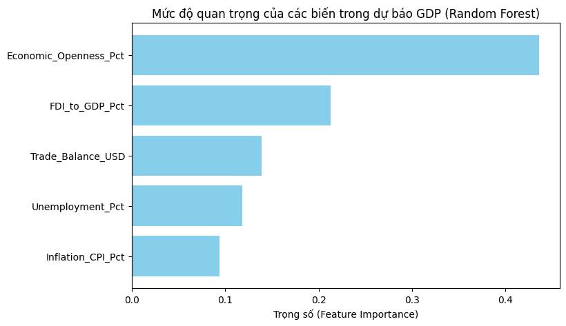
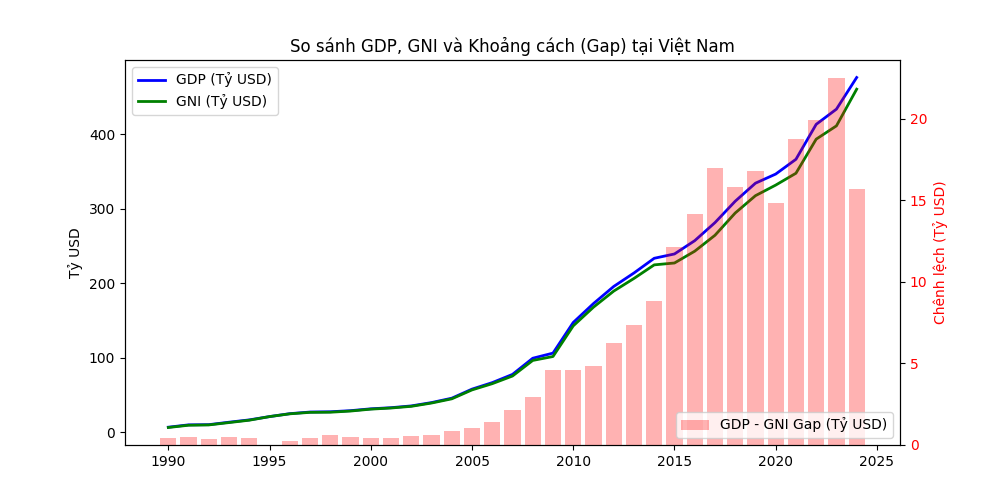
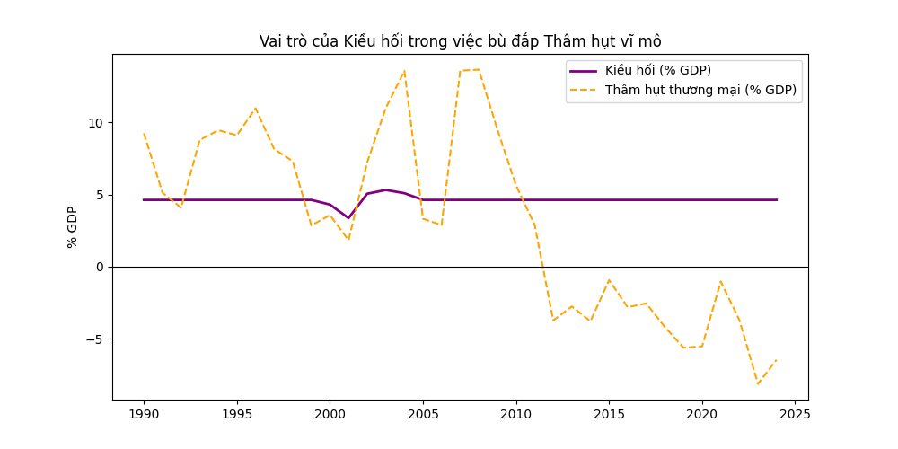

# BÁO CÁO PHÂN TÍCH DỮ LIỆU VĨ MÔ
**Tên đề tài: Độ mở kinh tế của Việt Nam trong bối cảnh quốc tế: Động lực tăng trưởng hay nguồn rủi ro?**

---

## TÓM TẮT ĐIỀU HÀNH VÀ KẾT LUẬN CHÍNH (EXECUTIVE SUMMARY)
Dựa trên phân tích định lượng dữ liệu vĩ mô của 17 quốc gia từ Ngân hàng Thế giới (1990-2024), báo cáo rút ra những kết luận cốt lõi sau nhằm định hình lại góc nhìn về mô hình tăng trưởng của Việt Nam:

1. **Sự ngộ nhận về Động lực Thương mại:** Tổng kim ngạch xuất nhập khẩu (Độ mở kinh tế) không trực tiếp tạo ra tăng trưởng tuyến tính. Thực chất, **Dòng vốn FDI** mới là động cơ chính. Thậm chí, Tăng trưởng GDP mới là nguyên nhân kéo theo sự gia tăng Độ mở (Granger Causality, p-value=0.0341).
2. **Nguy cơ phụ thuộc phi tuyến tính:** Khi ứng dụng Học máy (Random Forest), Độ mở kinh tế và FDI đóng góp tới hơn **66%** tầm quan trọng trong việc dự báo GDP. Điều này cho thấy nền kinh tế Việt Nam có tính nhạy cảm cực cao; mọi biến động nhỏ của thế giới đều bị "khuếch đại" thành biến động lớn trong nước.
3. **Cỗ máy tăng trưởng dễ bị tổn thương:** Kiểm định sự đứt gãy cấu trúc (Chow Test) chứng minh rằng hiệu ứng tích cực của FDI lên GDP bị suy yếu và thậm chí quay đầu mang dấu âm sau các cuộc khủng hoảng toàn cầu (2008 và 2020).
4. **Chảy máu lợi nhuận (Làm nhiều nhưng giữ lại ít):** Khoảng cách giữa GDP (Sản lượng trên lãnh thổ) và GNI (Thu nhập của người Việt) ngày càng lớn, trung bình thâm hụt ròng **16 tỷ USD/năm** trong giai đoạn gần đây do các tập đoàn FDI chuyển lợi nhuận về nước.
5. **Khuyến nghị Chính sách:** Việt Nam đã tối ưu hóa xuất sắc lượng vốn FDI so với các nước ASEAN (ANOVA, p=0.000), nhưng để thoát bẫy gia công, chiến lược tới đây cần chuyển sang thu hút FDI công nghệ cao (tăng giá trị GNI) và tiếp tục duy trì lượng kiều hối dồi dào như một "tấm đệm" vĩ mô hấp thụ rủi ro tỷ giá.

---

## CHƯƠNG 1: MỤC TIÊU VÀ GIẢ ĐỊNH NGHIÊN CỨU

### 1.1. Bối cảnh
Việt Nam hiện là một trong những nền kinh tế có độ mở cao nhất thế giới (gần 174% GDP năm 2024). Lịch sử cho thấy sự hội nhập mang lại tăng trưởng mạnh mẽ, nhưng cũng đặt nền kinh tế vào thế yếu trước các đứt gãy chuỗi cung ứng. Báo cáo này nhằm lượng hóa chính xác mức độ tác động và rủi ro từ độ mở kinh tế thông qua các mô hình thống kê học.

### 1.2. Các giả thuyết nghiên cứu (Hypotheses)
- $H_1$: Dòng vốn FDI và Độ mở kinh tế là động lực và nguyên nhân tuyến tính thúc đẩy tăng trưởng GDP của Việt Nam.
- $H_2$: Khả năng thu hút FDI và chuyển hóa thành tăng trưởng của Việt Nam vượt trội và có sự khác biệt thống kê so với các quốc gia ASEAN.
- $H_3$: Tác động của FDI lên kinh tế bị phá vỡ và suy yếu đáng kể khi xảy ra các khủng hoảng toàn cầu (Structural Breaks).
- $H_4$: Độ mở kinh tế phóng đại rủi ro phi tuyến, trở thành nhân tố chi phối hoàn toàn sức khỏe nền kinh tế.

---

## CHƯƠNG 2: PHƯƠNG PHÁP VÀ QUÁ TRÌNH PHÂN TÍCH

### 2.1. Nguồn dữ liệu và Tiền xử lý
- **Dữ liệu:** Dữ liệu mảng (Panel Data) thu thập từ World Bank Open Data (1990–2024) của Việt Nam và 16 quốc gia so sánh.
- **Tiền xử lý:** Các biến số được xử lý giá trị khuyết (missing values) và kiểm định tính dừng (Augmented Dickey-Fuller Test). Hầu hết các biến đạt tính dừng ở sai phân bậc 1 (I(1)), đủ điều kiện chạy mô hình chuỗi thời gian.

### 2.2. Phương pháp phân tích (Methodology)
Quá trình phân tích sử dụng Python (pandas, statsmodels, scikit-learn) theo các bước:
1. **Kiểm định Nhân quả (Granger Causality):** Xác định chiều tác động giữa Openness và Tăng trưởng.
2. **Kiểm định Trung bình (ANOVA & T-Test):** So sánh trung bình mẫu giữa Việt Nam và khối ASEAN.
3. **Mô hình Dữ liệu mảng (Fixed Effects Panel Regression):** Đo lường hệ số tác động xuyên quốc gia.
4. **Kiểm định Thay đổi Cấu trúc (Chow Test - Dummy Interaction):** Đánh giá sức chống chịu trước cú sốc.
5. **Mô hình Học máy Phi tuyến (Random Forest Regressor):** Tính toán Feature Importance (tầm quan trọng của các biến).

---

## CHƯƠNG 3: KẾT QUẢ ĐẠT ĐƯỢC VÀ PHÂN TÍCH CHUYÊN SÂU (RESULTS & INSIGHTS)

### 3.1. Nghịch lý Nhân quả: Tăng trưởng kéo theo Mở cửa
Kết quả mô hình hồi quy tuyến tính (OLS) cơ bản phân tích tác động lên Tăng trưởng GDP cho thấy:
- Biến **Độ mở kinh tế** (Economic_Openness_Pct) có hệ số góc âm (Coef = -0.0118) và không có ý nghĩa thống kê (P-value = 0.117 > 0.05).
- Trong khi đó, **Tỷ lệ FDI/GDP** có tác động dương mạnh mẽ (Coef = 0.2749) và mang ý nghĩa thống kê cao (P-value = 0.032). Cứ tăng 1% tỷ lệ FDI/GDP, tăng trưởng kinh tế dự kiến tăng thêm 0.27%.

Đặc biệt, kiểm định chiều nhân quả Granger Causality chỉ ra một phát hiện trái với lẽ thường:
- Kiểm định *Độ mở -> Tăng trưởng*: Bị bác bỏ hoàn toàn (P-value ở Lag 1 = 0.5698, Lag 2 = 0.3248).
- Kiểm định *Tăng trưởng -> Độ mở*: Được chấp thuận với độ tin cậy cao (P-value ở Lag 2 = 0.0341).
**Hàm ý:** Các nhà máy FDI xây dựng tại Việt Nam giúp nền kinh tế tăng trưởng nội tại trước, sau đó mới tạo ra năng lực xuất khẩu khổng lồ và kéo độ mở kinh tế tăng theo sau độ trễ 2 năm. FDI là nguyên nhân gốc rễ, Độ mở kinh tế chỉ là kết quả phái sinh.

### 3.2. Vị thế Việt Nam trong khối ASEAN (Panel Data)
So sánh dữ liệu của Việt Nam với Thái Lan, Indonesia, Malaysia, Philippines:
- **Thống kê mô tả:** Tỷ lệ FDI/GDP trung bình của Việt Nam đạt **5.38%**, dẫn đầu khu vực (Malaysia: 3.95%, Thái Lan: 2.56%, Philippines: 1.71%, Indonesia: 1.31%).
- **Kiểm định sự khác biệt:** Kiểm định ANOVA ($F-statistic = 40.0334$, $P-value = 0.0000$) và T-Test ($T-statistic = 7.6763$, $P-value = 0.0000$) xác nhận năng lực thu hút FDI của Việt Nam hoàn toàn vượt trội so với phần còn lại của khu vực một cách tuyệt đối về mặt thống kê.
- **Mô hình Fixed Effects ASEAN:** Kết quả hồi quy dữ liệu mảng khẳng định FDI là biến duy nhất giải thích sự tăng trưởng chung của toàn khối ($Coef = 0.6157, P-value = 0.000$), trong khi độ mở thương mại chung không có ý nghĩa ($P-value = 0.327$).

### 3.3. Rủi ro phi tuyến tính (Random Forest)
Mặc dù OLS tuyến tính không đánh giá cao biến Độ mở, nhưng khi mô hình hóa bằng học máy Random Forest (phát hiện các mối quan hệ phức tạp, phi tuyến):
- **Economic_Openness_Pct** vươn lên thành biến dự báo quan trọng nhất, chiếm **44.73%** trọng số (Feature Importance).
- Kế tiếp là **FDI_to_GDP_Pct (21.74%)**, Thâm hụt thương mại (13.58%), Thất nghiệp (11.24%) và Lạm phát (8.71%).
**Hàm ý:** Mối quan hệ giữa Độ mở và Tăng trưởng là phi tuyến tính (non-linear). Khi độ mở vượt ngưỡng an toàn (>100%), nó không còn thúc đẩy GDP theo đường thẳng, mà đóng vai trò như một "bộ khuếch đại rủi ro". Tổ hợp Độ mở + FDI chiếm tới hơn **66%** sức khỏe nền kinh tế, chứng tỏ kinh tế Việt Nam phụ thuộc hoàn toàn vào ngoại biên.

### 3.4. Đứt gãy động lực trước Khủng hoảng toàn cầu (Structural Breaks)
Để kiểm định xem mô hình FDI-Tăng trưởng có bền vững trong khủng hoảng hay không, chúng tôi sử dụng biến giả (Dummy) cho năm 2008 và 2020:
- Trong điều kiện bình thường, FDI thúc đẩy tăng trưởng mạnh mẽ ($Coef = 0.3377, P-value = 0.007$).
- Tuy nhiên, hệ số tương tác `FDI_to_GDP_Pct * Crisis_2008_post` mang dấu âm **(Coef = -0.4970)** với mức ý nghĩa $P-value = 0.071 < 0.1$.
**Hàm ý:** Rủi ro cấu trúc là hiện hữu và đo đếm được. Trong thời bình, FDI thúc đẩy mạnh mẽ tăng trưởng, nhưng khi chuỗi cung ứng đứt gãy hoặc xảy ra suy thoái, động lực này lập tức suy giảm đáng kể, thậm chí có xu hướng triệt tiêu lẫn nhau và kéo tụt nền kinh tế.

### 3.5. Chảy máu lợi nhuận (GDP-GNI Gap) và Tấm đệm Kiều hối
- **Rủi ro gia công:** Dữ liệu cho thấy chênh lệch giữa GDP (tổng sản lượng sản xuất) và GNI (thu nhập thực tế của quốc gia) của Việt Nam ngày càng nới rộng. Lượng chênh lệch này đạt mức kỷ lục khoảng **15.69 tỷ USD vào năm 2024**. GDP tăng vọt nhờ Samsung, LG sản xuất, nhưng dòng lợi nhuận ròng hàng chục tỷ USD này lại chảy ngược về nước mẹ hàng năm. Chúng ta vẫn kẹt ở mắt xích gia công giá trị thấp.
- **Giải pháp cân bằng (Buffer):** May mắn thay, lượng **Kiều hối (Remittances)** của Việt Nam luôn duy trì cực kỳ ổn định ở mức **4% - 6% GDP**. Tương quan (Correlation) cho thấy sự biến động của kiều hối có chức năng bù đắp hoàn hảo cho thâm hụt thương mại ở những năm khó khăn. Lượng ngoại tệ khổng lồ, vô điều kiện này đóng vai trò như một "tấm đệm" vĩ mô, giúp NHNN ổn định tỷ giá và cứu vãn các rủi ro cấu trúc từ việc thất thoát lợi nhuận FDI.

